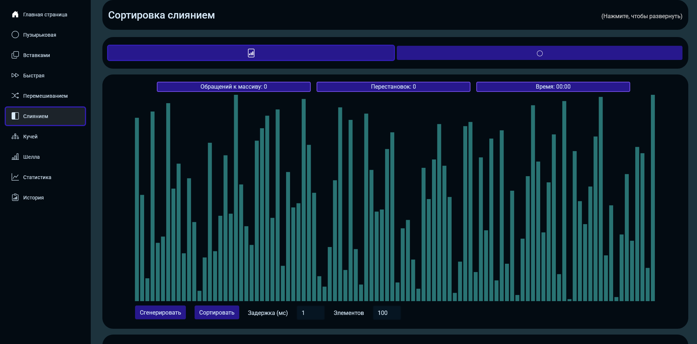
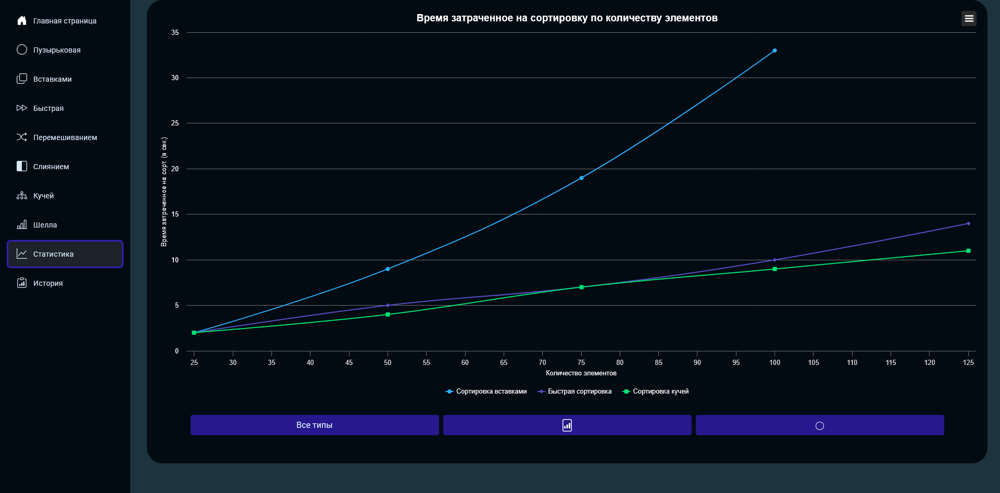

# 🌀 SortVisualizer

Веб-приложение для демонстрации работы алгоритмов сортировки данных.  
Приложение работает прямо в браузере и развернуто на **GitHub Pages**.

🔗 [Попробовать приложение](https://dobriytauren.github.io/SortVisualizer/)

---

## ✨ Возможности 

- 🧩 Демонстрация алгоритмов сортировки: пузырьковая, вставками, быстрая, перемешиванием, слиянием, кучей, Шелла  
- 🎨 Два вида визуализации: линейная (столбцы) и цветные шарики (по цветам радуги)  
- ⏱️ Настройка задержки сортировки и количества элементов  
- 📊 Статистика времени выполнения сортировок с графиками (Highcharts)  
- 💾 История сортировок сохраняется локально через Blazored.LocalStorage / IndexedDB  
- 🚀 SPA с боковым меню и адаптивным интерфейсом, работает без перезагрузки страниц  

---

## 📸 Скриншоты

### Светлая тема
 

### Тёмная тема
 

---

## 🛠️ Технологии

- Blazor WebAssembly  
- Bootstrap 5  
- Highcharts  
- Blazored.LocalStorage / IndexedDB  
